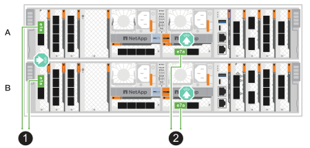
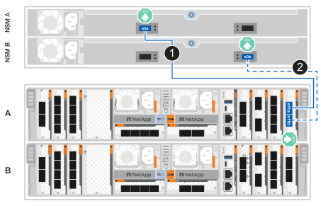
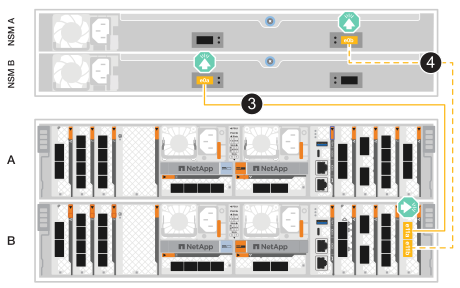

= Collegare l'hardware per i sistemi storage ASA A70 e ASA A90
:allow-uri-read: 
:icons: font
:imagesdir: ../media/

[role="lead"]
Collega il sistema storage ASA A70 o ASA A90 alla rete e agli shelf di storage per abilitare la comunicazione del cluster, l'accesso di gestione e la connettività host SAN. Questa procedura include il cablaggio per l'interconnessione cluster/HA, la rete di gestione, la rete host e le connessioni agli shelf di storage.

.Prima di iniziare
Contattare l'amministratore di rete per informazioni sulla connessione del sistema di archiviazione agli switch di rete.

.A proposito di questa attività
* Queste procedure mostrano le configurazioni comuni. Il cablaggio specifico dipende dai componenti ordinati per il sistema di storage in uso. Per informazioni dettagliate sulla configurazione e la priorità degli slot, vedere link:https://hwu.netapp.com["NetApp Hardware Universe"^].
* Gli slot di I/O sugli ASA A70 e ASA A90 sono numerati da 1 a 11.
+
image::../media/drw_a1K_back_slots_labeled_ieops-2162.svg[Numerazione degli slot su un controller ASA A70 e ASA A90]

* Le immagini dei cavi hanno icone a freccia che mostrano l'orientamento corretto (verso l'alto o verso il basso) della linguetta di estrazione del connettore del cavo quando si inserisce un connettore in una porta.
+
Quando si inserisce il connettore, si dovrebbe avvertire uno scatto in posizione; se non si sente uno scatto, rimuoverlo, capovolgere e riprovare.

+
image:../media/drw_cable_pull_tab_direction_ieops-1699.svg["Direzione della linguetta di estrazione del cavo"]

* Se si effettua il cablaggio a uno switch ottico, inserire il ricetrasmettitore ottico nella porta del controller prima di collegare il cavo alla porta dello switch.

[[step-1-cable-the-clusterha-connections]]
== Fase 1: Collegare i collegamenti cluster/ha

Collegare i controller per creare le connessioni del cluster ONTAP. Per i cluster senza switch, collegare i controller tra loro. Per i cluster con switch, collegare i controller agli switch di rete del cluster.

NOTE: Il traffico di cluster Interconnect e quello di ha condividono le stesse porte fisiche.

[role="tabbed-block"]
====
.Cablaggio cluster senza switch
--
Utilizzare questa opzione di cablaggio quando i due controller sono collegati direttamente tra loro senza utilizzare switch di rete cluster.

Utilizzare il cavo di interconnessione Cluster/ha per collegare le porte da E1a a E1a e le porte da e7a a e7a.

.Fasi
. Collegare la porta E1a del controller A alla porta E1a del controller B.
. Collegare la porta e7a del Controller A alla porta e7a del Controller B.
+
*Cavi di interconnessione cluster/ha*

+
image::../media/oie_cable_25Gb_Ethernet_SFP28_IEOPS-1069.svg[Cavo ha del cluster]

+
image::../media/drw_70-90_tnsc_cluster_cabling_ieops-1653.svg[Schema di cablaggio del cluster senza switch a due nodi]

--
.Cablaggio del cluster con switch
--
Utilizzare questa opzione di cablaggio quando i controller si connettono agli switch di rete del cluster anziché essere collegati direttamente tra loro.

Utilizzare il cavo 100 GbE per collegare le porte e1a ed e7a agli switch di rete del cluster.

NOTE: Le configurazioni cluster commutate sono supportate in ONTAP 9.16.1 e versioni successive.

.Fasi
. Collegare la porta E1a sul controller A e la porta E1a sul controller B allo switch di rete del cluster A.
. Collegare la porta e7a sul controller A e la porta e7a sul controller B allo switch di rete del cluster B.
+
*Cavo 100 GbE*

+
image::../media/oie_cable100_gbe_qsfp28.png[Cavo 100 GbE]

+

--
====

[[step-2-cable-the-host-network-connections]]
== Fase 2: Collegare i cavi delle connessioni di rete host

Collegare le porte del modulo Ethernet alla rete host.

Di seguito sono riportati alcuni esempi tipici di cablaggio di rete host. Vedere link:https://hwu.netapp.com["NetApp Hardware Universe"^] per la configurazione specifica del sistema.

[role="tabbed-block"]
====
.Rete host 100 GbE
--
Collega le porte e9a ed e9b allo switch di rete Ethernet da 100 GbE.

NOTE: Per ottenere le massime prestazioni di sistema per il traffico cluster e HA, non utilizzare le porte e1b ed e7b per le connessioni di rete host. Utilizzare una scheda host separata per massimizzare le prestazioni.

.Fasi
. Collegare la porta e9a del controller A e la porta e9a del controller B allo switch di rete Ethernet.
. Collegare la porta e9b del controller A e la porta e9b del controller B allo switch di rete Ethernet.
+
*Cavo 100 GbE*

+
image::../media/oie_cable_sfp_gbe_copper.svg[Cavo Ethernet 100 GbE]

+
image::../media/drw_70-90_network_cabling1_ieops-1654.svg[Cavo per rete Ethernet 100 GbE]

--
.Rete host 10/25 GbE
--
Collegare le porte del modulo I/O 10/25 GbE di ciascun controller agli switch di rete host.

*Cavo 10/25 GbE*

image::../media/oie_cable_sfp_gbe_copper.svg[Cavo 10/25 GbE]

image::../media/drw_70-90_network_cabling2_ieops-1655.svg[Cavo per la rete Ethernet 10/25 GbE]

--
====

[[step-3-cable-the-management-network-connections]]
== Fase 3: Collegare i collegamenti della rete di gestione

Collegare i controller alla rete di gestione.

Utilizzare i cavi 1000BASE-T RJ-45 per collegare le porte di gestione (chiave inglese) di ciascun controller agli switch di rete di gestione.

.Fasi
. Collegare la porta di gestione (chiave inglese) del controller A allo switch di rete di gestione.
. Collegare la porta di gestione (chiave inglese) del controller B allo switch di rete di gestione.
+
*CAVI RJ-45 1000BASE-T.

+
image::../media/oie_cable_rj45.svg[Cavi RJ-45]

+
image::../media/drw_70-90_management_connection_ieops-1656.svg[Connettersi alla rete di gestione]

IMPORTANT: Non collegare ancora i cavi di alimentazione.

[[step-4-cable-the-shelf-connections]]
== Fase 4: Collegare i collegamenti dei ripiani

I sistemi di storage ASA A70 e ASA A90 supportano gli shelf NS224 con il modulo NSM100 o NSM100B. Le principali differenze tra i moduli sono:

* I moduli shelf NSM100 utilizzano le porte integrate e0a ed e0b.
* I moduli shelf NSM100B utilizzano le porte e1a ed e1b nello slot 1.

I seguenti esempi di cablaggio mostrano i moduli NSM100 negli shelf NS224 quando si fa riferimento alle porte dei moduli degli shelf.

Per conoscere il numero massimo di ripiani supportati per il sistema di storage e per tutte le opzioni di cablaggio, ad esempio ottico e switch-attached, vedere link:https://hwu.netapp.com["NetApp Hardware Universe"^].

[role="tabbed-block"]
====
.Una shelf di storage NS224
--
Utilizzate questa opzione di cablaggio quando disponete di un singolo ripiano NS224.

Collegare ciascun controller ai moduli NSM sullo shelf NS224. La grafica mostra il cablaggio di ciascuno dei controller: Il cablaggio del controller A è mostrato in blu e il cablaggio del controller B è mostrato in giallo.

*Cavi in rame 100 GbE QSFP28*

.Fasi
. Collegare la porta e11a del controller A alla porta NSM A e0a.
. Collegare la porta e11b del controller A alla porta e0b dell'NSM B.
+

. Collegare la porta e11a del controller B alla porta NSM B e0a.
. Collegare la porta e11b del controller B alla porta NSM A e0b.
+

--
.Due shelf di storage NS224
--
Utilizzate questa opzione di cablaggio quando avete due shelf NS224.

Collegare ciascun controller ai moduli NSM su entrambi gli shelf NS224. La grafica mostra il cablaggio di ciascuno dei controller: Il cablaggio del controller A è mostrato in blu e il cablaggio del controller B è mostrato in giallo.

*Cavi in rame 100 GbE QSFP28*

.Fasi
. Sul controller A, collegare le seguenti porte:
+
.. Collegare la porta e11a alla porta e0a NSM A dello shelf 1.
.. Collegare la porta e8b alla porta e0b dello shelf 1 NSM B.
.. Collegare la porta e8a alla porta e0a dell'NSM A dello shelf 2.
.. Collegare la porta e11b alla porta NSM B e0b dello shelf 2.
+
image:../media/drw_a70-90_2shelf_cabling_a_ieops-1733.svg["Connessioni da controller a shelf per il controller A"]

. Sul controller B, collegare le seguenti porte:
+
.. Collegare la porta e11a alla porta NSM B e0a dello shelf 1.
.. Collegare la porta e8b alla porta e0b dell'NSM A dello shelf 1.
.. Collegare la porta e8a alla porta e0a dello shelf 2 NSM B.
.. Collegare la porta e11b alla porta e0b NSM A dello shelf 2.
+
image:../media/drw_a70-90_2shelf_cabling_b_ieops-1734.svg["Connessioni da controller a shelf per il controller B"]

--
====
.Quali sono le prossime novità?
Dopo aver collegato i controller di archiviazione alla rete e successivamente i controller agli shelf di archiviazione, è possibile link:power-on-hardware.html["Accendere il sistema di archiviazione ASA R2"].
