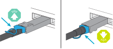
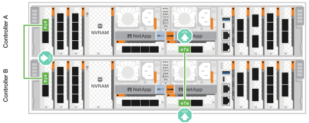
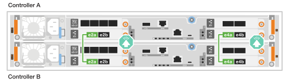
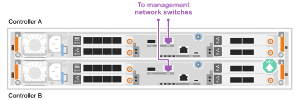
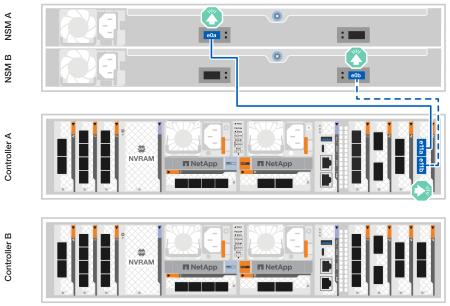

= Collegare l'hardware per il sistema di storage ASA R2
:allow-uri-read: 
:icons: font
:imagesdir: ../media/

[role="lead"]
Dopo aver installato l'hardware rack per il sistema di storage ASA R2, installare i cavi di rete per i controller e collegare i cavi tra i controller e gli shelf di storage.

.Prima di iniziare
Contattare l'amministratore di rete per informazioni sulla connessione del sistema di archiviazione agli switch di rete.

.A proposito di questa attività
* Queste procedure mostrano le configurazioni comuni. Il cablaggio specifico dipende dai componenti ordinati per il sistema di storage in uso. Per informazioni dettagliate sulla configurazione e la priorità degli slot, vedere link:https://hwu.netapp.com["NetApp Hardware Universe"^].
* Le procedure di cablaggio cluster/ha e rete host mostrano le configurazioni comuni.
+
Se non vedi la tua configurazione nelle procedure di cablaggio, vai a link:https://hwu.netapp.com["NetApp Hardware Universe"^] per informazioni complete sulla configurazione e sulla priorità degli slot per cablare correttamente il sistema di storage.

* Se si dispone di un sistema di archiviazione ASA A1K, ASA A70 o ASA A90, gli slot I/O sono numerati da 1 a 11.
+
image::../media/drw_a1K_back_slots_labeled_ieops-2162.svg[Numerazione degli slot su un controller ASA A1K ASA A70 e ASA A90]

* Le immagini dei cavi hanno icone a freccia che mostrano l'orientamento corretto (verso l'alto o verso il basso) della linguetta di estrazione del connettore del cavo quando si inserisce un connettore in una porta.
+
Quando si inserisce il connettore, si dovrebbe avvertire uno scatto in posizione; se non si sente uno scatto, rimuoverlo, capovolgere e riprovare.

+

* Se si effettua il cablaggio a uno switch ottico, inserire il ricetrasmettitore ottico nella porta del controller prima di collegare il cavo alla porta dello switch.

== Fase 1: Collegare i collegamenti cluster/ha

Collegare i controller al cluster ONTAP. Questa procedura varia in base al modello del sistema di storage in uso e alla configurazione del modulo i/O.

NOTE: Il traffico di cluster Interconnect e quello di ha condividono le stesse porte fisiche.

[role="tabbed-block"]
====
.A1K
--
Creare connessioni al cluster ONTAP. Per i cluster senza switch, collegare i controller l'uno all'altro. Per i cluster commutati, collegare i controller agli switch di rete del cluster.

.Cablaggio cluster senza switch
[%collapsible]
=====
Utilizzare il cavo di interconnessione Cluster/ha per collegare le porte da E1a a E1a e le porte da e7a a e7a.

.Fasi
. Collegare la porta E1a del controller A alla porta E1a del controller B.
. Collegare la porta e7a del controller A alla porta E1a del controller B.
+
*Cavi di interconnessione cluster/ha*

+
image::../media/oie_cable_25Gb_Ethernet_SFP28_IEOPS-1069.svg[Cavo ha del cluster]

+
image::../media/drw_a1k_tnsc_cluster_cabling_ieops-1648.svg[Schema di cablaggio del cluster senza switch a due nodi]

=====
.Cablaggio del cluster con switch
[%collapsible]
=====
Utilizzare il cavo 100 GbE per collegare le porte da E1a a E1a e le porte da e7a a e7a.

NOTE: Le configurazioni cluster con switch sono supportate in 9.16.1 e versioni successive.

.Fasi
. Collegare la porta E1a sul controller A e la porta E1a sul controller B allo switch di rete del cluster A.
. Collegare la porta e7a sul controller A e la porta e7a sul controller B allo switch di rete del cluster B.
+
*Cavo 100 GbE*

+
image::../media/oie_cable100_gbe_qsfp28.png[Cavo da 100 GB]

+
image::../media/drw_a1k_switched_cluster_cabling_ieops-1652.svg[Connessioni cluster via cavo alla rete cluster]

=====
--
.A70 e A90
--
Creare connessioni al cluster ONTAP. Per i cluster senza switch, collegare i controller l'uno all'altro. Per i cluster commutati, collegare i controller agli switch di rete del cluster.

.Cablaggio cluster senza switch
[%collapsible]
=====
Utilizzare il cavo di interconnessione Cluster/ha per collegare le porte da E1a a E1a e le porte da e7a a e7a.

.Fasi
. Collegare la porta E1a del controller A alla porta E1a del controller B.
. Collegare la porta e7a del controller A alla porta E1a del controller B.
+
*Cavi di interconnessione cluster/ha*

+
image::../media/oie_cable_25Gb_Ethernet_SFP28_IEOPS-1069.svg[Cavo ha del cluster]

+

=====
.Cablaggio del cluster con switch
[%collapsible]
=====
Utilizzare il cavo 100 GbE per collegare le porte da E1a a E1a e le porte da e7a a e7a.

NOTE: Le configurazioni cluster con switch sono supportate in 9.16.1 e versioni successive.

.Fasi
. Collegare la porta E1a sul controller A e la porta E1a sul controller B allo switch di rete del cluster A.
. Collegare la porta e7a sul controller A e la porta e7a sul controller B allo switch di rete del cluster B.
+
*Cavo 100 GbE*

+
image::../media/oie_cable100_gbe_qsfp28.png[Cavo da 100 GB]

+
image::../media/drw_70-90_switched_cluster_cabling_ieops-1657.svg[Connessioni cluster via cavo alla rete cluster]

=====
--
.A20, A30 E A50
--
Creare connessioni al cluster ONTAP. Per i cluster senza switch, collegare i controller l'uno all'altro. Per i cluster commutati, collegare i controller agli switch di rete del cluster.

[NOTE]
====
Gli esempi di cablaggio cluster/HA mostrano configurazioni comuni.

Se non vedi la tua configurazione qui, vai a link:https://hwu.netapp.com["NetApp Hardware Universe"^] per informazioni complete sulla configurazione e sulla priorità degli slot per cablare il sistema di archiviazione.

====
*Cablaggio cluster senza switch*

Collegare i controller l'uno all'altro per creare connessioni del cluster ONTAP.

.ASA A30 e ASA A50 con due moduli i/o GbE a 2 porte da 40/100 GB
[%collapsible]
=====
.Fasi
. Collegare le connessioni di interconnessione cluster/ha:
+

NOTE: Il traffico di cluster Interconnect e il traffico ha condividono le stesse porte fisiche (sui moduli i/o negli slot 2 e 4). Le porte sono 40/100 GbE.

+
.. Collegare la porta E2A del controller A alla porta E2A del controller B.
.. Collegare la porta e4a del controller A alla porta e4a del controller B.
+

NOTE: Le porte dei moduli i/o E2B e e4b non sono utilizzate e sono disponibili per la connettività di rete host.

+
*100 cavi di interconnessione cluster/ha GbE*

+
image::../media/oie_cable100_gbe_qsfp28.png[Cavo ha 100 GbE cluster]

+

=====
.ASA A30 e ASA A50 con un modulo i/o GbE a 2 porte da 40/100 GB
[%collapsible]
=====
.Fasi
. Collegare le connessioni di interconnessione cluster/ha:
+

NOTE: Il traffico di cluster Interconnect e il traffico ha condividono le stesse porte fisiche (sul modulo i/o nello slot 4). Le porte sono 40/100 GbE.

+
.. Collegare la porta e4a del controller A alla porta e4a del controller B.
.. Collegare la porta e4b del controller A alla porta e4b del controller B.
+
*100 cavi di interconnessione cluster/ha GbE*

+
image::../media/oie_cable100_gbe_qsfp28.png[Cavo ha 100 GbE cluster]

+
image::../media/drw_isi_a30-50_switchless_2p_100gbe_1card_cabling_ieops-1925.svg[schema di cablaggio del cluster senza switch a30 e a50 utilizzando un modulo io 100gbe]

=====
.ASA A20 con un modulo i/o GbE a 2 porte da 10/25 GB
[%collapsible]
=====
.Fasi
. Collegare le connessioni di interconnessione cluster/ha:
+

NOTE: Il traffico di cluster Interconnect e il traffico ha condividono le stesse porte fisiche (sul modulo i/o nello slot 4). Le porte sono 10/25 GbE.

+
.. Collegare la porta e4a del controller A alla porta e4a del controller B.
.. Collegare la porta e4b del controller A alla porta e4b del controller B.
+
*25 cavi di interconnessione cluster/ha GbE*

+
image:../media/oie_cable_sfp_gbe_copper.png["Connettore GbE SFP in rame, larghezza=100px"]

+
image::../media/drw_isi_a20_switchless_2p_25gbe_cabling_ieops-2018.svg[diagramma di cablaggio del cluster senza switch a20 utilizzando un modulo io 25 gbe]

=====
*Cablaggio cluster commutato*

Collegare i controller agli switch di rete cluster per creare connessioni cluster ONTAP.

.ASA A30 o ASA A50 con due moduli i/o GbE a 2 porte da 40/100 GB
[%collapsible]
=====
.Fasi
. Collegare le connessioni di interconnessione cluster/ha:
+

NOTE: Il traffico di cluster Interconnect e il traffico ha condividono le stesse porte fisiche (sui moduli i/o negli slot 2 e 4). Le porte sono 40/100 GbE.

+
.. Collegare la porta e4a del controller A allo switch di rete del cluster A.
.. Collegare la porta e2a del controller A allo switch di rete del cluster B.
.. Collegare la porta e4a del controller B allo switch di rete del cluster A.
.. Collegare la porta e2a del controller B allo switch di rete del cluster B.
+

NOTE: Le porte dei moduli i/o E2B e e4b non sono utilizzate e sono disponibili per la connettività di rete host.

+
*40/100 cavi di interconnessione cluster/ha GbE*

+
image::../media/oie_cable100_gbe_qsfp28.png[Cavo ha 40/100 GbE cluster]

+
image::../media/drw_isi_a30-50_switched_2p_100gbe_2card_cabling_ieops-2013.svg[schema di cablaggio del cluster commutato a30 e a50 utilizzando due moduli io 100gbe]

=====
.ASA A30 o ASA A50 con un modulo i/o GbE a 2 porte da 40/100 GB
[%collapsible]
=====
.Fasi
. Collegare i controller agli switch di rete cluster:
+

NOTE: Il traffico di cluster Interconnect e il traffico ha condividono le stesse porte fisiche (sul modulo i/o nello slot 4). Le porte sono 40/100 GbE.

+
.. Collegare la porta e4a del controller A allo switch di rete del cluster A.
.. Collegare la porta e4b del controller A allo switch di rete del cluster B.
.. Collegare la porta e4a del controller B allo switch di rete del cluster A.
.. Collegare la porta e4b del controller B allo switch di rete del cluster B.
+
*40/100 cavi di interconnessione cluster/ha GbE*

+
image::../media/oie_cable100_gbe_qsfp28.png[Cavo ha 40/100 GbE cluster]

+
image::../media/drw_isi_a30-50_2p_100gbe_1card_switched_cabling_ieops-1926.svg[Connessioni cluster via cavo alla rete cluster]

=====
.ASA A20 con un modulo i/o GbE a 2 porte da 10/25 GB
[%collapsible]
=====
. Collegare i controller agli switch di rete cluster:
+

NOTE: Il traffico di cluster Interconnect e il traffico ha condividono le stesse porte fisiche (sul modulo i/o nello slot 4). Le porte sono 10/25 GbE.

+
.. Collegare la porta e4a del controller A allo switch di rete del cluster A.
.. Collegare la porta e4b del controller A allo switch di rete del cluster B.
.. Collegare la porta e4a del controller B allo switch di rete del cluster A.
.. Collegare la porta e4b del controller B allo switch di rete del cluster B.
+
*10/25 cavi di interconnessione cluster/ha GbE*

+
image::../media/oie_cable_sfp_gbe_copper.png[Connettore GbE SFP in rame]

+
image::../media/drw_isi_a20_switched_2p_25gbe_cabling_ieops-2019.svg[diagramma di cablaggio del cluster con a20 switch utilizzando un modulo io 25gbe]

=====
--
.C30
--
Creare connessioni al cluster ONTAP. Per i cluster senza switch, collegare i controller l'uno all'altro. Per i cluster commutati, collegare i controller agli switch di rete del cluster.

[NOTE]
====
Gli esempi di cablaggio cluster/HA mostrano configurazioni comuni.

Se non vedi la tua configurazione qui, vai a link:https://hwu.netapp.com["NetApp Hardware Universe"^] per informazioni complete sulla configurazione e sulla priorità degli slot per cablare il sistema di archiviazione.

====
*Cablaggio cluster senza switch*

Collegare i controller l'uno all'altro per creare connessioni del cluster ONTAP.

.ASA C30 con due moduli I/O 40/100 GbE a 2 porte
[%collapsible]
=====
.Fasi
. Collegare le connessioni di interconnessione cluster/ha:
+

NOTE: Il traffico di cluster Interconnect e il traffico ha condividono le stesse porte fisiche (sui moduli i/o negli slot 2 e 4). Le porte sono 40/100 GbE.

+
.. Collegare la porta E2A del controller A alla porta E2A del controller B.
.. Collegare la porta e4a del controller A alla porta e4a del controller B.
+

NOTE: Le porte dei moduli i/o E2B e e4b non sono utilizzate e sono disponibili per la connettività di rete host.

+
*100 cavi di interconnessione cluster/ha GbE*

+
image::../media/oie_cable100_gbe_qsfp28.png[Cavo ha 100 GbE cluster]

+

=====
.ASA C30 con un modulo I/O 40/100 GbE a 2 porte
[%collapsible]
=====
.Fasi
. Collegare le connessioni di interconnessione cluster/ha:
+

NOTE: Il traffico di cluster Interconnect e il traffico ha condividono le stesse porte fisiche (sul modulo i/o nello slot 4). Le porte sono 40/100 GbE.

+
.. Collegare la porta e4a del controller A alla porta e4a del controller B.
.. Collegare la porta e4b del controller A alla porta e4b del controller B.
+
*100 cavi di interconnessione cluster/ha GbE*

+
image::../media/oie_cable100_gbe_qsfp28.png[Cavo ha 100 GbE cluster]

+
image::../media/drw_isi_a30-50_switchless_2p_100gbe_1card_cabling_ieops-1925.svg[diagramma di cablaggio del cluster senza switch c30 utilizzando un modulo io 100gbe]

=====
*Cablaggio cluster commutato*

Collegare i controller agli switch di rete cluster per creare connessioni cluster ONTAP.

.ASA C30 con due moduli I/O 40/100 GbE a 2 porte
[%collapsible]
=====
.Fasi
. Collegare le connessioni di interconnessione cluster/ha:
+

NOTE: Il traffico di cluster Interconnect e il traffico ha condividono le stesse porte fisiche (sui moduli i/o negli slot 2 e 4). Le porte sono 40/100 GbE.

+
.. Collegare la porta e4a del controller A allo switch di rete del cluster A.
.. Collegare la porta e2a del controller A allo switch di rete del cluster B.
.. Collegare la porta e4a del controller B allo switch di rete del cluster A.
.. Collegare la porta e2a del controller B allo switch di rete del cluster B.
+

NOTE: Le porte dei moduli i/o E2B e e4b non sono utilizzate e sono disponibili per la connettività di rete host.

+
*40/100 cavi di interconnessione cluster/ha GbE*

+
image::../media/oie_cable100_gbe_qsfp28.png[Cavo ha 40/100 GbE cluster]

+
image::../media/drw_isi_a30-50_switched_2p_100gbe_2card_cabling_ieops-2013.svg[schema di cablaggio del cluster commutato C30 utilizzando due moduli IO da 100 GBE]

=====
.ASA C30 con un modulo I/O 40/100 GbE a 2 porte
[%collapsible]
=====
.Fasi
. Collegare i controller agli switch di rete del cluster:
+

NOTE: Il traffico di cluster Interconnect e il traffico ha condividono le stesse porte fisiche (sul modulo i/o nello slot 4). Le porte sono 40/100 GbE.

+
.. Collegare la porta e4a del controller A allo switch di rete del cluster A.
.. Collegare la porta e4b del controller A allo switch di rete del cluster B.
.. Collegare la porta e4a del controller B allo switch di rete del cluster A.
.. Collegare la porta e4b del controller B allo switch di rete del cluster B.
+
*40/100 cavi di interconnessione cluster/ha GbE*

+
image::../media/oie_cable100_gbe_qsfp28.png[Cavo ha 40/100 GbE cluster]

+
image::../media/drw_isi_a30-50_2p_100gbe_1card_switched_cabling_ieops-1926.svg[Connessioni cluster via cavo alla rete cluster]

=====
--
====

== Fase 2: Collegare i cavi delle connessioni di rete host

Collegare i controller alla rete host.

Questa procedura varia in base al modello del sistema di storage in uso e alla configurazione del modulo i/O.

[role="tabbed-block"]
====
.A1K
--
Collegare le porte del modulo Ethernet alla rete host.

Di seguito sono riportati alcuni esempi tipici di cablaggio della rete host. Per informazioni sulla configurazione specifica del sistema, vedere link:https://hwu.netapp.com["NetApp Hardware Universe"^] .

.Fasi
. Collegare le porte e9a e e9b allo switch di rete dati Ethernet.
+

NOTE: Per ottenere le massime performance di sistema per il traffico cluster e ha, non utilizzare le porte e1b e e7b per le connessioni di rete host. Utilizzare una scheda host separata per ottimizzare le prestazioni.

+
*Cavo 100 GbE*

+
image::../media/oie_cable_sfp_gbe_copper.svg[100GB cavo Ethernet]

+
image::../media/drw_a1k_network_cabling1_ieops-1649.svg[Cavo alla rete Ethernet 100GB]

. Collegare gli switch di rete host 10/25 GbE.
+
*Host 10/25 GbE*

+
image::../media/oie_cable_sfp_gbe_copper.svg[Cavo Ethernet 10/25GB]

+
image::../media/drw_a1k_network_cabling2_ieops-1650.svg[Cavo alla rete Ethernet 10/25GB]

--
.A70 e A90
--
Collegare le porte del modulo Ethernet alla rete host.

Di seguito sono riportati alcuni esempi tipici di cablaggio della rete host. Per informazioni sulla configurazione specifica del sistema, vedere link:https://hwu.netapp.com["NetApp Hardware Universe"^] .

.Fasi
. Collegare le porte e9a e e9b allo switch di rete dati Ethernet.
+

NOTE: Per ottenere le massime performance di sistema per il traffico cluster e ha, non utilizzare le porte e1b e e7b per le connessioni di rete host. Utilizzare una scheda host separata per ottimizzare le prestazioni.

+
*Cavo 100 GbE*

+
image::../media/oie_cable_sfp_gbe_copper.svg[100GB cavo Ethernet]

+
image::../media/drw_70-90_network_cabling1_ieops-1654.svg[Cavo alla rete Ethernet da 100 GB]

. Collegare gli switch di rete host 10/25 GbE.
+
*4 porte, 10/25 GbE host*

+
image::../media/oie_cable_sfp_gbe_copper.svg[Cavo da 10/25 GB]

+
image::../media/drw_70-90_network_cabling2_ieops-1655.svg[Cavo alla rete Ethernet 100GB]

--
.A20, A30 E A50
--
Collegare le porte del modulo Ethernet o le porte del modulo Fibre Channel (FC) alla rete host.

[NOTE]
====
Gli esempi di cablaggio della rete host mostrano configurazioni comuni.

Se non vedi la tua configurazione qui, vai a link:https://hwu.netapp.com["NetApp Hardware Universe"^] per informazioni complete sulla configurazione e sulla priorità degli slot per cablare il sistema di archiviazione.

====
*Cablaggio host Ethernet*

.ASA A30 e ASA A50 con due moduli i/o GbE a 2 porte da 40/100 GB
[%collapsible]
=====
Su ciascun controller, collegare le porte E2B e e4b agli switch di rete host Ethernet.

NOTE: Le porte sui moduli i/o negli slot 2 e 4 sono 40/100 GbE (la connettività host è 40/100 GbE).

*Cavi 40/100 GbE*

image::../media/oie_cable_sfp_gbe_copper.png[Cavo da 40/100 GB]

image::../media/drw_isi_a30-50_host_2p_40-100gbe_2card_cabling_ieops-2014.svg[Collegare gli switch di rete host ethernet 40/100GbE]

=====
.ASA A20, A30 e A50 con un modulo I/O 10/25 GbE a 4 porte
[%collapsible]
=====
Su ciascun controller, collegare le porte E2A, E2B, e2c e e2d agli switch di rete host Ethernet.

*Cavi 10/25 GbE*

image:../media/oie_cable_sfp_gbe_copper.png["Connettore GbE SFP in rame, larghezza=100px"]

image::../media/drw_isi_a30-50_host_2p_40-100gbe_1card_cabling_ieops-1923.svg[Collegare gli switch di rete host ethernet 40/100GbE]

=====
*Cablaggio host FC*

.ASA A20, A30 e A50 con un modulo I/O FC a 4 porte da 64 Gb/s
[%collapsible]
=====
Su ciascun controller, collegare le porte 1a, 1b, 1c e 1d agli switch di rete host FC.

*Cavi FC da 64 GB/s*

image:../media/oie_cable_sfp_gbe_copper.png["Cavo fc da 64 GB, larghezza=100px"]

image::../media/drw_isi_a30-50_4p_64gb_fc_1card_cabling_ieops-1924.svg[Cavo per 64GB switch di rete host fc]

=====
--
.C30
--
Collegare le porte del modulo Ethernet o le porte del modulo Fibre Channel (FC) alla rete host.

[NOTE]
====
Gli esempi di cablaggio della rete host mostrano configurazioni comuni.

Se non vedi la tua configurazione qui, vai a link:https://hwu.netapp.com["NetApp Hardware Universe"^] per informazioni complete sulla configurazione e sulla priorità degli slot per cablare il sistema di archiviazione.

====
*Cablaggio host Ethernet*

.ASA C30 con due moduli I/O 40/100 GbE a 2 porte
[%collapsible]
=====
.Fasi
. Su ciascun controller, collegare le porte E2B e e4b agli switch di rete host Ethernet.
+

NOTE: Le porte sui moduli i/o negli slot 2 e 4 sono 40/100 GbE (la connettività host è 40/100 GbE).

+
*Cavi 40/100 GbE*

+
image::../media/oie_cable_sfp_gbe_copper.png[Cavo da 40/100 GB]

+
image::../media/drw_isi_a30-50_host_2p_40-100gbe_2card_cabling_ieops-2014.svg[Collegare gli switch di rete host ethernet 40/100GbE]

=====
.ASA C30 con un modulo i/o GbE a 4 porte da 10/25 GB
[%collapsible]
=====
.Fasi
. Su ciascun controller, collegare le porte E2A, E2B, e2c e e2d agli switch di rete host Ethernet.
+
*Cavi 10/25 GbE*

+
image:../media/oie_cable_sfp_gbe_copper.png["Connettore GbE SFP in rame, larghezza=100px"]

+
image::../media/drw_isi_a30-50_host_2p_40-100gbe_1card_cabling_ieops-1923.svg[Collegare gli switch di rete host ethernet 40/100GbE]

=====
.ASA C30 con un modulo I/O FC a 4 porte da 64 Gb/s
[%collapsible]
=====
.Fasi
. Su ciascun controller, collegare le porte 1a, 1b, 1c e 1d agli switch di rete host FC.
+
*Cavi FC da 64 GB/s*

+
image:../media/oie_cable_sfp_gbe_copper.png["Cavo fc da 64 GB, larghezza=100px"]

+
image::../media/drw_isi_a30-50_4p_64gb_fc_1card_cabling_ieops-1924.svg[Cavo per 64GB switch di rete host fc]

=====
--
====

== Fase 3: Collegare i collegamenti della rete di gestione

Collegare i controller alla rete di gestione.

Contattare l'amministratore di rete per informazioni sulla connessione del sistema di archiviazione agli switch di rete di gestione.

[role="tabbed-block"]
====
.A1K
--
Utilizzare i cavi 1000BASE-T RJ-45 per collegare le porte di gestione (chiave inglese) di ciascun controller agli switch di rete di gestione.

image::../media/oie_cable_rj45.svg[Cavi RJ-45]

*CAVI RJ-45 1000BASE-T.

image::../media/drw_a1k_management_connection_ieops-1651.svg[Connettersi alla rete di gestione]

IMPORTANT: Non collegare ancora i cavi di alimentazione.

--
.A70 e A90
--
Utilizzare i cavi 1000BASE-T RJ-45 per collegare le porte di gestione (chiave inglese) di ciascun controller agli switch di rete di gestione.

image::../media/oie_cable_rj45.svg[RJ45 cavi]

*CAVI RJ-45 1000BASE-T.

image::../media/drw_70-90_management_connection_ieops-1656.svg[Connettersi alla rete di gestione]

IMPORTANT: Non collegare ancora i cavi di alimentazione.

--
.A20, A30 E A50
--
Collegare le porte di gestione (chiave inglese) su ciascun controller agli switch di rete di gestione.

*CAVI RJ-45 1000BASE-T.

image::../media/oie_cable_rj45.png[Cavi RJ-45]

IMPORTANT: Non collegare ancora i cavi di alimentazione.

--
.C30
--
Collegare le porte di gestione (chiave inglese) su ciascun controller agli switch di rete di gestione.

*CAVI RJ-45 1000BASE-T.

image::../media/oie_cable_rj45.png[Cavi RJ-45]

IMPORTANT: Non collegare ancora i cavi di alimentazione.

--
====

== Fase 4: Collegare i collegamenti dei ripiani

Le seguenti procedure di cablaggio mostrano come collegare i controller a uno shelf di archiviazione.

Per conoscere il numero massimo di ripiani supportati per il sistema di storage e per tutte le opzioni di cablaggio, ad esempio ottico e switch-attached, vedere link:https://hwu.netapp.com["NetApp Hardware Universe"^].

[role="tabbed-block"]
====
.A1K
--
I sistemi di archiviazione AFF A1K supportano ripiani NS224 con modulo NSM100 o NSM100B. Le principali differenze tra i moduli sono:

* I moduli a scaffale NSM100 utilizzano le porte integrate e0a ed e0b.
* I moduli shelf NSM100B utilizzano le porte e1a ed e1b nello slot 1.

Il seguente esempio di cablaggio mostra i moduli NSM100 negli scaffali NS224 quando si fa riferimento alle porte dei moduli sugli scaffali.

Scegliere una delle seguenti opzioni di cablaggio che corrisponda alla propria configurazione.

.Opzione 1: Uno shelf storage NS224
[%collapsible]
=====
Collegare ciascun controller ai moduli NSM sullo shelf NS224. La grafica mostra il cablaggio di ciascuno dei controller: Il cablaggio del controller A è mostrato in blu e il cablaggio del controller B è mostrato in giallo.

.Fasi
. Sul controller A, collegare le seguenti porte:
+
.. Collegare la porta e11a alla porta NSM A e0a.
.. Collegare la porta e11b alla porta NSM B e0b.
+

. Sul controller B, collegare le seguenti porte:
+
.. Collegare la porta e11a alla porta NSM B e0a.
.. Collegare la porta e11b alla porta NSM A e0b.
+
image:../media/drw_a1k_1shelf_cabling_b_ieops-1704.svg["Collegare le porte e11a ed e11b del controller B a un singolo ripiano NS224"]

=====
.Opzione 2: Due shelf storage NS224
[%collapsible]
=====
Collegare ciascun controller ai moduli NSM su entrambi gli shelf NS224. La grafica mostra il cablaggio di ciascuno dei controller: Il cablaggio del controller A è mostrato in blu e il cablaggio del controller B è mostrato in giallo.

.Fasi
. Sul controller A, collegare le seguenti porte:
+
.. Collegare la porta e11a alla porta e0a NSM A dello shelf 1.
.. Collegare la porta e11b alla porta NSM B e0b dello shelf 2.
.. Collegare la porta E10A alla porta e0a NSM A dello shelf 2.
.. Collegare la porta e10b alla porta e0b NSM A dello shelf 1.
+
image:../media/drw_a1k_2shelf_cabling_a_ieops-1705.svg["Connessioni da controller a shelf per il controller A"]

. Sul controller B, collegare le seguenti porte:
+
.. Collegare la porta e11a alla porta NSM B e0a dello shelf 1.
.. Collegare la porta e11b alla porta e0b NSM A dello shelf 2.
.. Collegare la porta E10A alla porta NSM B e0a dello shelf 2.
.. Collegare la porta e10b alla porta e0b NSM A dello shelf 1.
+
image:../media/drw_a1k_2shelf_cabling_b_ieops-1706.svg["Connessioni da controller a shelf per il controller B"]

=====
--
.A70 e A90
--
I sistemi di archiviazione AFF A70 e 90 supportano ripiani NS224 con il modulo NSM100 o NSM100B. Le principali differenze tra i moduli sono:

* I moduli shelf NSM100 utilizzano le porte integrate e0a ed e0b.
* I moduli shelf NSM100B utilizzano le porte e1a ed e1b nello slot 1.

Il seguente esempio di cablaggio mostra i moduli NSM100 negli scaffali NS224 quando si fa riferimento alle porte dei moduli sugli scaffali.

Scegliere una delle seguenti opzioni di cablaggio che corrisponda alla propria configurazione.

.Opzione 1: Uno shelf storage NS224
[%collapsible]
=====
Collegare ciascun controller ai moduli NSM sullo shelf NS224. La grafica mostra il cablaggio di ciascuno dei controller: Il cablaggio del controller A è mostrato in blu e il cablaggio del controller B è mostrato in giallo.

*Cavi in rame 100 GbE QSFP28*

image::../media/oie_cable100_gbe_qsfp28.svg[Cavo in rame da 100 GbE QSFP28]

.Fasi
. Collegare la porta e11a del controller A alla porta NSM A e0a.
. Collegare la porta e11b del controller A alla porta NSM B e0b.
+
image:../media/drw_a70-90_1shelf_cabling_a_ieops-1731.svg["Controller A e11a e e11b su un singolo shelf NS224"]

. Collegare la porta e11a del controller B alla porta NSM B e0a.
. Collegare la porta e11b del controller B alla porta NSM A e0b.
+
image:../media/drw_a70-90_1shelf_cabling_b_ieops-1732.svg["Controller B e11a e e11b su un singolo shelf NS224"]

=====
.Opzione 2: Due shelf storage NS224
[%collapsible]
=====
Collegare ciascun controller ai moduli NSM su entrambi gli shelf NS224. La grafica mostra il cablaggio di ciascuno dei controller: Il cablaggio del controller A è mostrato in blu e il cablaggio del controller B è mostrato in giallo.

*Cavi in rame 100 GbE QSFP28*

image::../media/oie_cable100_gbe_qsfp28.svg[Cavo in rame da 100 GbE QSFP28]

.Fasi
. Sul controller A, collegare le seguenti porte:
+
.. Collegare la porta e11a allo shelf 1, la porta NSM A e0a.
.. Collegare la porta e11b allo shelf 2, la porta NSM B e0b.
.. Collegare la porta E8a allo shelf 2, la porta NSM A e0a.
.. Collegare la porta e8b allo shelf 1, la porta NSM B e0b.
+
image:../media/drw_a70-90_2shelf_cabling_a_ieops-1733.svg["Connessioni da controller a shelf per il controller A"]

. Sul controller B, collegare le seguenti porte:
+
.. Collegare la porta e11a allo shelf 1, la porta NSM B e0a.
.. Collegare la porta e11b allo shelf 2, la porta NSM A e0b.
.. Collegare la porta E8a allo shelf 2, la porta NSM B e0a.
.. Collegare la porta e8b allo shelf 1, la porta NSM A e0b.
+
image:../media/drw_a70-90_2shelf_cabling_b_ieops-1734.svg["Connessioni da controller a shelf per il controller B"]

=====
--
.A20, A30 E A50
--
La procedura di cablaggio a scaffale NS224 mostra moduli NSM100B anziché moduli NSM100. Il cablaggio è lo stesso indipendentemente dal tipo di modulo NSM utilizzato, solo i nomi delle porte sono diversi:

* I moduli NSM100B utilizzano le porte e1a ed e1b su un modulo I/O nello slot 1.
* I moduli NSM100 utilizzano le porte integrate (onboard) e0a ed e0b.

Collegare ciascun controller a ciascun modulo NSM sullo scaffale NS224 utilizzando i cavi di archiviazione forniti con il sistema di archiviazione, che potrebbero essere del seguente tipo:

*Cavi in rame 100 GbE QSFP28*

image::../media/oie_cable100_gbe_qsfp28.png[Cavo in rame da 100 GbE QSFP28]

La grafica mostra il cablaggio del controller A in blu e il cablaggio del controller B in giallo.

.Fasi
. Collegare il controller A allo shelf:
+
.. Collegare la porta e3a del controller A alla porta NSM A e1a.
.. Collegare la porta E3B del controller A alla porta NSM B e1b.
+
image:../media/drw_isi_g_1_ns224_controller_a_cabling_ieops-1945.svg["Porte e3a e E3B del controller A cablate su uno shelf NS224"]

. Collegare il controller B al ripiano:
+
.. Collegare la porta e3a del controller B alla porta NSM B e1a.
.. Collegare la porta e3b del controller B alla porta NSM A e1b.
+
image:../media/drw_isi_g_1_ns224_controller_b_cabling_ieops-1946.svg["Porte e3a e E3B del controller B collegate a uno shelf NS224"]

--
.C30
--
La procedura di cablaggio a scaffale NS224 mostra moduli NSM100B anziché moduli NSM100. Il cablaggio è lo stesso indipendentemente dal tipo di modulo NSM utilizzato, solo i nomi delle porte sono diversi:

* I moduli NSM100B utilizzano le porte e1a ed e1b su un modulo I/O nello slot 1.
* I moduli NSM100 utilizzano le porte integrate (onboard) e0a ed e0b.

Collegare ciascun controller a ciascun modulo NSM sullo scaffale NS224 utilizzando i cavi di archiviazione forniti con il sistema di archiviazione, che potrebbero essere del seguente tipo:

*Cavi in rame 100 GbE QSFP28*

image::../media/oie_cable100_gbe_qsfp28.png[Cavo in rame da 100 GbE QSFP28]

La grafica mostra il cablaggio del controller A in blu e il cablaggio del controller B in giallo.

.Fasi
. Collegare il controller A allo shelf:
+
.. Collegare la porta e3a del controller A alla porta NSM A e1a.
.. Collegare la porta E3B del controller A alla porta NSM B e1b.
+
image:../media/drw_isi_g_1_ns224_controller_a_cabling_ieops-1945.svg["Porte e3a e E3B del controller A cablate su uno shelf NS224"]

. Collegare il controller B al ripiano:
+
.. Collegare la porta e3a del controller B alla porta NSM B e1a.
.. Collegare la porta e3b del controller B alla porta NSM A e1b.
+
image:../media/drw_isi_g_1_ns224_controller_b_cabling_ieops-1946.svg["Porte e3a e E3B del controller B collegate a uno shelf NS224"]

--
====
.Quali sono le prossime novità?
Dopo aver collegato i controller di archiviazione alla rete e successivamente i controller agli shelf di archiviazione, è possibile link:power-on-hardware.html["Accendere il sistema di archiviazione ASA R2"].
