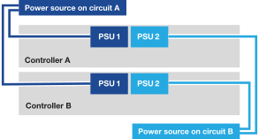

= Accendere il sistema di storage ASA R2
:allow-uri-read: 
:icons: font
:imagesdir: ../media/

[role="lead"]
Dopo aver installato l'hardware rack per il sistema di storage ASA R2 e aver installato i cavi per i controller e gli shelf di storage, è necessario accendere gli shelf e i controller di storage.

== Passaggio 1: Accendere lo shelf e assegnare l'ID dello shelf

Ogni ripiano si distingue per un ID di ripiano univoco. Grazie a questo ID, lo shelf si distingue all'interno della configurazione del sistema storage.

.A proposito di questa attività
* Un ID ripiano valido è compreso tra 01 e 99.
+
Se si dispone di shelf interni (storage), integrati nei controller, viene assegnato un ID shelf fisso pari a 00.

* Per rendere effettivo l'ID dello shelf, è necessario spegnere e riaccendere uno shelf (scollegare entrambi i cavi di alimentazione, attendere il tempo necessario e ricollegarlo).

.Fasi
. Accendere lo shelf collegando prima i cavi di alimentazione allo shelf, fissandoli in posizione con il fermo del cavo di alimentazione, quindi collegando i cavi di alimentazione a sorgenti di alimentazione su circuiti diversi.
+
Lo shelf si accende e si avvia automaticamente quando viene collegato alla fonte di alimentazione.

. Rimuovere il cappuccio terminale sinistro per accedere al pulsante ID ripiano dietro la mascherina.
+
image::../media/drw_change_ns224_shelf_id_ieops-836.svg[Modificare l'ID dello shelf]

+
[cols="20%,80%"]
|===

 a| 
image::../media/icon_round_1.png[Numero di didascalia 1]
 a| 
Tappo terminale dello scaffale

 a| 
image::../media/icon_round_2.png[[Numero di didascalia 2]
 a| 
Mascherina dello scaffale

 a| 
image::../media/icon_round_3.png[[Numero di didascalia 3]
 a| 
Numero ID ripiano

 a| 
image::../media/icon_round_4.png[[Numero di didascalia 4]
 a| 
Pulsante ID ripiano

|===
. Modificare il primo numero dell'ID dello shelf:
+
.. Inserire l'estremità dritta di una graffetta o una penna a sfera con punta stretta nel foro piccolo per premere il pulsante ID ripiano.
.. Tenere premuto il pulsante ID ripiano finché il primo numero sul display digitale non lampeggia, quindi rilasciare il pulsante.
+
Il lampeggiamento del numero può richiedere fino a 15 secondi. In questo modo viene attivata la modalità di programmazione degli ID dello shelf.

+

NOTE: Se l'ID richiede più di 15 secondi per lampeggiare, tenere premuto nuovamente il pulsante ID ripiano, assicurandosi di premerlo completamente.

.. Premere e rilasciare il pulsante ID ripiano per far avanzare il numero fino a raggiungere il numero desiderato da 0 a 9.
+
La durata di ogni stampa e rilascio può essere di un solo secondo.

+
Il primo numero continua a lampeggiare.

. Modificare il secondo numero dell'ID dello shelf:
+
.. Tenere premuto il pulsante fino a quando il secondo numero sul display digitale non lampeggia.
+
Il lampeggiamento del numero può richiedere fino a tre secondi.

+
Il primo numero sul display digitale smette di lampeggiare.

.. Premere e rilasciare il pulsante ID ripiano per far avanzare il numero fino a raggiungere il numero desiderato da 0 a 9.
+
Il secondo numero continua a lampeggiare.

. Bloccare il numero desiderato e uscire dalla modalità di programmazione tenendo premuto il pulsante ID ripiano finché il secondo numero non smette di lampeggiare.
+
Il numero può richiedere fino a tre secondi per smettere di lampeggiare.

+
Entrambi i numeri sul display digitale iniziano a lampeggiare e il LED ambra si illumina dopo circa cinque secondi, avvisando che l'ID ripiano in sospeso non ha ancora avuto effetto.

. Spegnere e riaccendere lo shelf per almeno 10 secondi per rendere effettivo l'ID dello shelf.
+
.. Scollegare il cavo di alimentazione da entrambi gli alimentatori presenti sullo shelf.
.. Attendere 10 secondi.
.. Ricollegare i cavi di alimentazione agli alimentatori per completare il ciclo di alimentazione.
+
Un alimentatore si accende non appena il cavo di alimentazione viene collegato. Il LED a due colori si illumina di verde.

. Sostituire il cappuccio terminale sinistro.

== Fase 2: Accendere i controller

Dopo aver acceso i ripiani di archiviazione e assegnato loro ID univoci, attivare l'alimentazione ai controller di archiviazione.

.Fasi
. Collegare il computer portatile alla porta seriale della console. Ciò consente di monitorare la sequenza di avvio quando i controller sono accesi.
+
.. Impostare la porta seriale della console del computer portatile a 115.200 baud con N-8-1.
+
Per istruzioni su come configurare la porta seriale della console, consultare la guida in linea del laptop.

.. Collegare il cavo della console al computer portatile e la porta seriale della console sul controller utilizzando il cavo della console fornito con il sistema di archiviazione.
.. Collegare il computer portatile allo switch sulla subnet di gestione.
+
[role="tabbed-block"]
====
.A1K
--
image::../media/drw_a1k_70-90_console_connection_ieops-1702.svg[Collegamenti della console]

--
.A70 e A90
--
image::../media/drw_a1k_70-90_console_connection_ieops-1702.svg[Collegamenti della console]

--
.A20, A30 E A50
--
image::../media/drw_g_isi_console_serial_port_cabling_ieops-1882.svg[Collegamenti della console]

--
.C30
--
image::../media/drw_g_isi_console_serial_port_cabling_ieops-1882.svg[Collegamenti della console]

--
====

. Assegnare un indirizzo TCP/IP al computer portatile, utilizzando un indirizzo presente nella subnet di gestione.
. Collegare i cavi di alimentazione agli alimentatori del controller, quindi collegarli a fonti di alimentazione su diversi circuiti.
+
[role="tabbed-block"]
====
.A1K
--

--
.A70 e A90
--

--
.A20, A30 E A50
--
image::../media/drw_psu_layout_1_ieops-1886.svg[Schema di collegamento dell'alimentazione del sistema di archiviazione A20 o A30 o A50]

--
.C30
--
image::../media/drw_psu_layout_1_ieops-1886.svg[Schema di collegamento dell'alimentazione del sistema di archiviazione A20 o A30 o A50]

--
====
+
** Il sistema avvia il processo di avvio. La sequenza di avvio iniziale può richiedere fino a otto minuti.
** Durante il processo di avvio, i LED lampeggiano e le ventole si attivano, segnalando che i controller si stanno accendendo.
** Tenere presente che le ventole potrebbero emettere un elevato livello di rumore al primo avvio. Il rumore della ventola all'avviamento è normale.
** Nei sistemi di archiviazione ASA A20, A30, A50 e ASA C30, il display ID scaffale sulla parte anteriore del telaio del sistema non si illumina.

. Fissare i cavi di alimentazione utilizzando il dispositivo di fissaggio su ciascun alimentatore.

.Quali sono le prossime novità?
Dopo aver acceso il sistema di archiviazione ASA R2, si link:initialize-ontap-cluster.html["Configurare un cluster ONTAP ASA R2"].
